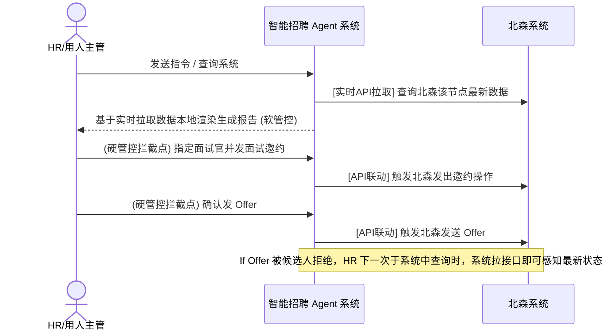

# 北森智能招聘系统 (基于 Agno) - 产品需求文档 (PRD)

## 1. 产品概述

### 1.1 背景与目标
当前企业内部招聘强依赖 HR、用人主管和面试官的个人经验，存在评估标准主观、面试准备耗时、多轮面评难以有效对齐等痛点。
本项目旨在基于 **Agno 框架**构建一组 AI Agent，并**单向拉取协同北森招聘系统**的数据，打造覆盖“招聘需求准备 → 简历初筛 → 面试邀约 → 面试题生成 → 面试评价 → 人才横向比对 → 发送 Offer”全生命周期的智能招聘应用，实现工程级提效。

### 1.2 核心产品原则
1. **单向数据流**：以北森为源头（拉取JD模板、简历库、面评表），加工计算结果留存在本系统内部，不对北森进行写回操作。
2. **意图驱动与实时查询**：基于用户在系统中的指令或查询意图，实时调用北森接口拉取最新数据即可。不采用定时推送或 Webhook 模式，避免系统冗余。
3. **分层管控策略 (HITL)**：
   - **软管控（报告类结果）**：JD、简历初筛打分、面试题、候选人评价报告等。系统自动流转生成报告，默许人工同意。
   - **硬管控（触达类结果）**：发送面试邀请（确定面试官与时间）、发送 Offer 决策。**必须强制人工干预确认**。

---

## 2. 核心系统模块与 Agent 规则说明

### 2.0 智能招聘系统主干业务流 (Mermaid)

### 2.1 招聘需求准备 (JD 阶段)
*   **执行组件**：`JD生成 Agent`
*   **输入源**：业务部门的基础需求描述 / 历史相似 JD 数据（来自北森）。
*   **输出物**：排版标准化的《职位说明书》(JD)。
*   **交互逻辑**：状态驱动生成，用户有新指令输入时覆盖最新版本。生成后无异议则自动落库，进入下一步。

### 2.2 简历初筛
*   **执行组件**：`简历初筛 Agent`
*   **输入源**：生成的 JD + 北森简历库数据。
*   **输出物**：候选人“推荐”或“淘汰”的结论标签，及初筛亮点与风险分析。
*   **交互逻辑（软管控）**：系统静默批处理，自动将达到匹配阈值的候选人移入“待邀约池”（默许流转）。HR 或用人主管随时可在界面上输入指令或直接操作来驳回/淘汰候选人。

### 2.3 面试邀请 🔴【强管控拦截点】
*   **业务逻辑**：阻断动作。系统拦截任何自动发邀约的行为。
*   **人工操作**：必须由 HR/助理 在界面上手动**指定面试官**且**设定具体面试时间**并点击确认执行。
*   **流出动作**：向下游发送邮件/短信，并触发下游面试题 Agent。

### 2.4 面试题生成
*   **执行组件**：`面试题生成 Agent`
*   **解耦设计说明**：此处的面试题**不**受北森评价表（专业/领导力/文化等）四维度的强制约束。
*   **输入源（Context）**：
    1. 候选人当前面试轮次（缺省状态如一面时则忽略历史记录）。
    2. JD 及 候选人简历原件。
    3. 简历初筛报告中指出的建议深挖方向。
    4. 历史轮次（若有）的面试评价与面试结论。
    5. 用人主管的特别反馈偏好（重点考察什么）。
*   **输出物**：极具针对性的面试问答清单，供面试官参考。
*   **API 降级策略**：若大模型推理超时或报错，系统直接展示绑定在该岗位 / 职级下的**静态默认题库**，绝不中断面试官阅览。

### 2.5 候选人评价生成
*   **执行组件**：`候选人评价 Agent`
*   **输入源**：面试人员在北森系统中录入的结构化面评表（如星级分数、优缺点文本、结论“通过/待定/淘汰”）。
*   **输出物**：一份丰富、标准化、综合详实的千字《候选人单人述职/评价报告》。
*   **交互逻辑（意图驱动）**：当用户在系统查询对应候选人时，系统实时拉取北森最新面评表并本地渲染缓存，取消Webhook或定时同步更新机制。
*   **防幻觉设计（溯源）**：为防止 AI 凑字数或过度脑补未发生的事实，页面支持**评价文本高亮溯源**，鼠标悬停千字报告即可透出北森底表中对应的原始短文本或星级评分。

### 2.6 候选人横向对比
*   **执行组件**：`横向对比 Agent`
*   **触发时机**：同一岗位存在两名及以上候选人推进至中后期。
*   **输出物**：能力雷达图对比、优劣势矩阵对比表格、录用建议顺位。
*   **输入源**：各候选人的综合评价报告。

### 2.7 录用决策与发 Offer 🔴【强管控拦截点】
*   **业务逻辑**：阻断动作。系统拦截最终录用通知。
*   **人工操作**：Hiring Manager 与 HR 明确审阅横向比对结果，由人工填写/确认薪酬架构及职级，点击【确认录用发送】。
*   **接口联动闭环**：点击发送后，系统将直接调用北森 Offer API 触发正式流程。若发放后候选人拒绝 Offer，该状态将留在北森系统。本系统后续查询 Offer 阶段的该候选人时，会实时读取其被拒绝的最新状态。

### 2.8 招聘总结与复盘
*   **执行组件**：`总结复盘 Agent`
*   **功能说明**：岗位招聘关闭后，通过全局视角复盘整体漏斗（投递量、淘汰率、录用周期），沉淀经验库并自动生成报告。

---

## 3. 全局异常处理与边界设定

### 3.1 弱网与生成超时防呆
* **场景**：Agent 调用商业模型超时或服务抖动导致失败。
* **规则**：虽然业务无显性“重新生成”按钮，但当报告块生成失败时，在此块留白并显示错误图文与“由于网络抖动生成遇到异常，可输入任意指令重试触发”的小贴士；面试题必须做强降级并显示默认库。

### 3.2 数据并发写入策略
* **场景**：用户正在通过输入指令要求 AI 根据某种倾向改写报告，而北森后台刚好推送了面评更新产生冲突。
* **规则**：并发计算时，**用户手动输入的最新自然语言 Prompt (Context) 拥有最高优先级**，最后一步的 Agent 组装必定合并此时最新的人工意图。

### 3.3 极端数据丢失防腐保障
* **场景**：由于极少数极端情况（如在北森系统中直接物理删除候选人资料或误退回起步阶段等），导致本系统无法通过接口拉取到北森系统的有效历史数据。
* **规则**：虽发生小概率删库、撤销事件，但本平台生成阶段性报告后即会留存历史只读快照。若接口查询不到，系统保留展示最后一次成功生成的快照以供复盘追溯。

## 4. 功能详细设计 (Feature Spec)

*(注：底层 API 映射及具体异常防重试机制等技术抽象，交由研发团队在架构设计文档中闭环，本章节仅约束产品前端界面与核心交互功能。)*

### 4.1 招聘需求准备 (JD Workspace)

#### Feature 4.1.1: 招聘意图解析与JD生成
* **功能目标**：将业务部门口语化的招聘需求描述，快速转换为北森系统内结构化、排版规范的职位说明书 (JD)。
* **用户故事**：作为用人主管，我希望只需输入一句简单的人才要求，系统就能结合北森历史类似岗位模板，自动生成排版完整、要求合理的JD，免去我手动粘贴修改格式的痛苦。
* **交互流程**：
  1. 用户在“JD 生成器”页面输入简单的自然语言指令，如“需要一个3年经验的Java，偏微服务方向”。
  2. 页面进入 loading，系统后台调用 Agent 分析指令并拉取北森类似岗位的历史JD骨架。
  3. 系统在富文本区流式渲染出标准化 JD。
  4. 用户在富文本区直接进行内容微调。
  5. 确认无误后点击【生成最终版并保存】。
* **界面要素**：
  * **自然语言输入框**：支持多行意图指令输入。
  * **JD 预览富文本区**：支持在生成的文本上直接进行光标编辑和格式调整。
  * **操作按钮**：【重新生成】、【生成最终版并保存】。
* **业务规则**：
  * JD 一旦被确认并保存，即刻在底层创建一条只读记录，并在内部系统解锁进入下一环节“初筛漏斗”，不再与北森系统自动做回写同步（单向）。
  * 每次在输入框输入新指令并提交，均会全盘覆盖下方的富文本区最新生成结果。
* **异常场景 (Edge Cases)**：
  * **生成超时**：调用大模型超过 15 秒未返回完整内容，富文本区显示提示“生成似乎有些缓慢，请重试或手动编辑”。
* **验收标准 (Acceptance Criteria)**：
  * `[正常流]` 能够根据口语化短文本，生成包含完整“岗位职责”和“任职要求”等结构的 JD。
  * `[正常流]` 用户能在生成的富文本结果中进行格式和文字的二次修改。

### 4.2 智能初筛与候选人流转

#### Feature 4.2.1: 智能初筛候选人看板 (AI Candidate Pipeline)
* **功能目标**：替代人工逐份阅览简历，按 JD 标准自动对入库简历完成打分与分类分组，高亮匹配亮点与致命缺陷，大幅提升初筛过滤的效率。
* **用户故事**：作为 HR 或用人主管，我希望系统能在 JD 发布后自动对候选人库进行打分扫描，并把候选人分为“高优推荐 / 待定 / 严重不符”几组，提供精炼的推荐语，以便我能以 10 倍速度圈定要邀约的人。
* **交互流程**：
  1. 用户进入对应职位的初筛工作台。
  2. 页面默认展示分 Tab 的候选人看板（AI 推荐顺位排列）。系统自动从北森拉取最新候选增量并显示由大模型生成的分析卡片。
  3. 用户点击某张候选人卡片，右侧抽屉展开，展示 AI 提炼的【匹配亮点】和【潜在风险】。
  4. 用户在卡片或抽屉页下方进行决策点击：【淘汰】或进入【发起邀约】。
* **界面要素**：
  * **漏斗统计 Dashboard**：展示“投递总量”、“AI高优推荐量”、“已淘汰量”。
  * **分组 Tab**：高优推荐 (>=80%) / 勉强符合 (60~79%) / 严重不符 (<60%)。
  * **候选人分析卡片**：包含姓名、核心学历历程。以及 **AI 智能标签**（红绿色块，如“🟢精通微服务”、“🔴三年四跳”、“🔴缺乏带人经验”）。
* **业务规则**：
  * **软管控免干预**：AI 自动完成打标并分入不同池中，但绝不自动向外网/候选人发送任何淘汰或拒绝信。
  * **强制重算机制**：当该职位的 JD 在上游被用户微调并二次发布后，当前在库未处理候选人的匹配得分须全部自动清空并触发重算。
* **异常场景 (Edge Cases)**：
  * **文件解析失败**：遇到非常规图片或加密 PDF 导致文本提取失败无法打分时，把卡片打入异常分类，高亮提示：“⚠ 解析失败，需人工开启原件审阅”。
* **验收标准 (Acceptance Criteria)**：
  * `[正常流]` 校验候选人列表必须展现正确的 AI 分析标签，且所引述的亮点能与原始简历文本对齐。
  * `[正常流]` 点击“淘汰”某张卡片，该名片立即呈现灰度不可用，随后从推荐视图中消失。

#### Feature 4.2.2: 面试邀约强管控 (Interview Invitation Hard-Gate)
* **功能目标**：系统进行【强管控拦截】，阻断 AI 擅自流转邀约或乱填面试官，必须由明确的自然人决策人填写并核验时间安排，防止出现乌龙安排。
* **用户故事**：作为 HR，我希望在推进优质候选人到面试前，必须手动指定具体的首面面试官姓名和时间段，防止 AI 错发邮件通知并产生无法撤回的后果。
* **交互流程**：
  1. 用户在候选人看板中点击某候选人的【发起邀约】按钮。
  2. 系统强拦截，弹出「邀约阻断确认表单」。
  3. 用户在此表单中，通过搜索选择本次面试官，并利用时间控件选择准确面谈时间。
  4. 提交确认。系统生成报文调用北森 API 发出邀约，并且更新当前列表状态。
* **界面要素**：
  * **阻断式 Modal 层**：强调此步骤为强规则。
  * **面试官搜索下拉器**：支持对接员工库的主数据检索。
  * **面试时间选择器**：包含具体日期和时段选择。
* **业务规则**：
  * `面试官ID` 和 `面试时段` 字段为绝对必填项，未填值前，【确认发放】必须置灰。
  * **禁止批量机制**：系统不允许勾选多名候选人点一键批量邀约，必须单人单次操作。
* **异常场景 (Edge Cases)**：
  * **API 响应超时或限流**：请求下发邀约遇到北森服务不通时，前端气泡报错“同步北森流转状态失败”，且**保持表单状态数据不丢失，候选人状态不流转**。
* **验收标准 (Acceptance Criteria)**：
  * `[正常流]` 弹窗项填写完整，点击确认后前端展现成功提示，候选人状态即时变更为“已邀约”。
  * `[例外流]` 接口调取失败报错时，不能修改候选人前端视图状态。

### 4.3 智能面试辅助与评价

#### Feature 4.3.1: 动态面试问答题库
* **功能目标**：为面试官提供针对当前候选人经历和 JD 偏好的定制化面试提问参考。
* **用户故事**：作为面试官，我在开面前常常没有足够时间仔细看建立，我希望系统提供一份提纲，告诉我该重点问什么、挖掘什么坑。
* **交互流程**：
  1. 面试官进入候选人的“面试辅助面板”。
  2. 面板已自动基于候选人初筛风险点和过去几轮面评，渲染好 5-10 道结构化的高针对性问题。
* **界面要素**：
  * **面试题库列表**：每道题需标注考察维度（如“技术深度”、“抗压能力”）和提问话术原句。
* **业务规则**：
  * 问题生成属于前置异步任务，当上一个节点 HR 发出面邀时即刻触发生成。
* **异常场景 (Edge Cases)**：
  * 大模型生成超时或报错时系统直接展示绑定在该岗位下的**静态默认题库**，确保即使 AI 异常也不中断面试官查阅题库的正常流程。
* **验收标准 (Acceptance Criteria)**：
  * `[正常流]` 提供的问题必须关联到这名候选人的特定简历经历（而不是纯通用问题）。
  * `[异常流]` 关闭 LLM 接口权限后刷新页面，能够成功呈现默认题库。

#### Feature 4.3.2: 单人面评防幻觉溯源报告
* **功能目标**：取代原先零散的星级和一句话短评，生成流畅的千字总结报告，同时支持一键查看原始打分证据以证伪 AI 幻觉。
* **交互流程**：
  1. 系统监听到候选人面评表在北森系统中录入完成，并在系统内查询该人时自动渲染该报告。
  2. 用户在前端阅读汇总报告时，如果对某句大模型提炼的结论（如“候选人技术底子薄弱”）产生疑惑。
  3. 鼠标悬停该段句子，会弹出对应的北森原始短语或打分截图（如“一面试官: Java基础打分2星”）。
* **界面要素**：
  * **AI 综合评估富文本**。
  * **高亮文本与 Tooltip 溯源框**。
* **业务规则**：
  * 仅做只读渲染。不回写任何评估结论给北森。

### 4.4 录用决策与数据复盘

#### Feature 4.4.1: 横向雷达对比与 Offer 阻断
* **功能目标**：对走到终面同岗位的多名候选人进行指标 PK，然后在发 Offer 时执行强制信息阻断填写。
* **界面要素**：
  * **多维能力雷达图**：对比 2 位及以上候选人的雷达图。
  * **Offer 录用表单 (强拦截)**：必填项含【薪酬架构】、【职级】及【入职日期】。
* **业务规则**：
  * 所有录用结果不留存在本工作流，点击“决定发送”后直接通过 API 通知给北森。属于强管控。

---

## 5. 下步研发阶段规划建议
1. **API 对接梳理**：明确拉取北森接口的频率（Webhook推送还是定时Pull），以及北森 Open API 的字段映射（尤其是录入的原生星级评价表）。
2. **Agno 提示词工程落地**：针对 6 个 Agent，撰写对应的 Role / Tool / Task Prompt。
3. **MVP 前端研发**：先行开发硬拦截点（面试邀请表单、Offer控制），软管控节点的报告以 Markdown 组件只读 + 指令输入框的形式优先实现。

---

## 附：多角色协同故事线 (User Playbook)

| 阶段 | 角色视角: Hiring Manager (用人主管) | 角色视角: HR | 角色视角: 面试官 | 智能体动作 (Agent) |
| :--- | :--- | :--- | :--- | :--- |
| **01 需求启动** | 在系统输入一句话：“我要招个懂大模型评估的QA岗”。收到一份标准化排版好的 JD。 | 无需动作，只读查阅即可。 | - | `JD Agent` 自动丰富该条指令并填入北森岗位的标准骨架中，渲染为页面只读区块。 |
| **02 初筛到邀约**| 可以在系统里看到由 AI 推送过来的“推荐名单”与各自的高光点分析。 | 审阅名单；如果没问题，必须在系统**显式指定“一面的面试官是谁、时间是几点”**，以此解锁红点，发邀约短信。 | - | `初筛 Agent` 根据 JD 静默将简历池洗一遍；待HR发邀约后，`面试题 Agent` 跟进排队。 |
| **03 面试实施** | - | - | 打开系统看到 AI 针对该候选人生成的结构化面题清单。面完后去**北森原生系统**按常规流程填星打分。 | `面试题 Agent` 结合简历薄弱点定向吐出“挖坑题”。 |
| **04 评估聚合** | 当查询该候选人时，看到了详尽的千字面评。如怀疑 AI 瞎吹，可鼠标悬停关键句子查看原始评价分数。| 可以查阅各阶段详尽的综合面评。 | - | `评价 Agent` 接到北森面评更新事件，在后台默默转写成流畅、带有上下文总结的综述报告。 |
| **05 决策Offer**| 如果有两个通过的人，在最终页看大图/雷达图PK结果。如果敲定了张三，**审批定薪发Offer**并解锁该红点拦截。 | 审阅PK大图；在最终决定环节输入入职信息准备入档。 | - | `横向对比 Agent` 会在两人都面完时触发多模态雷达图渲染。 |
