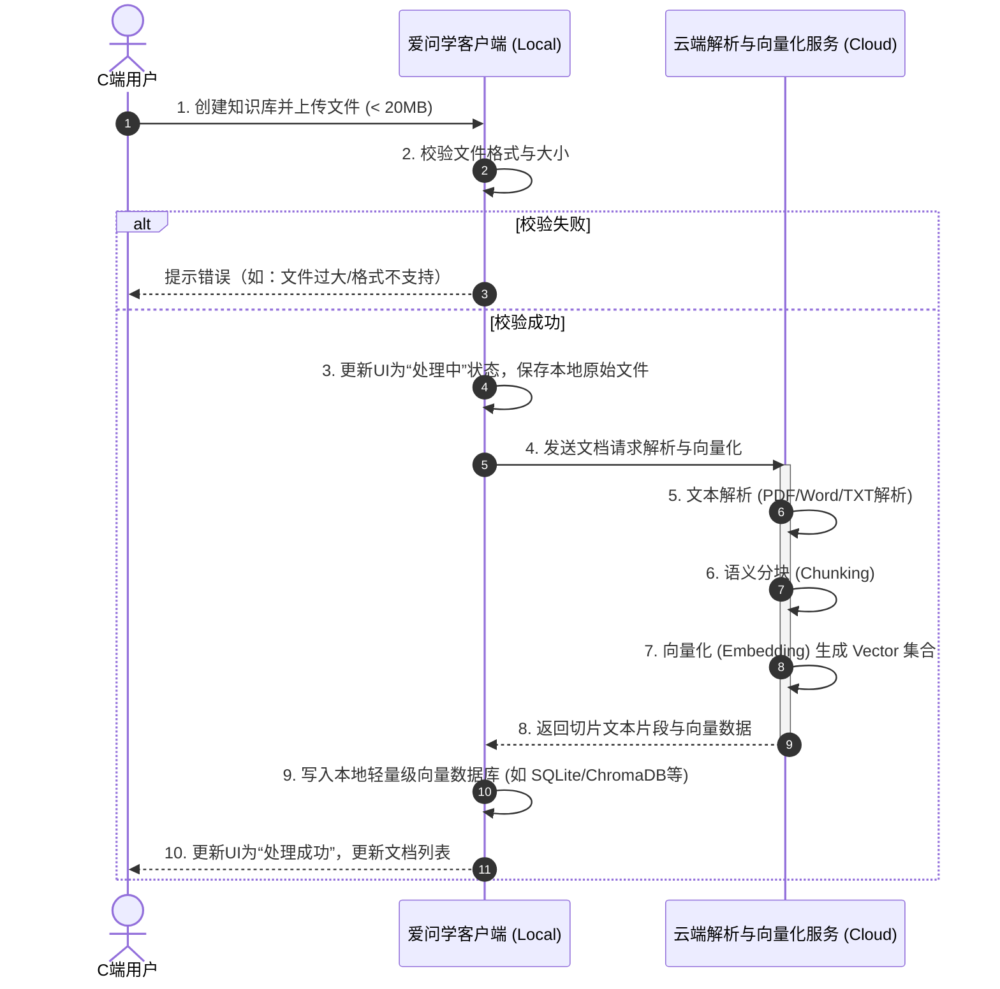
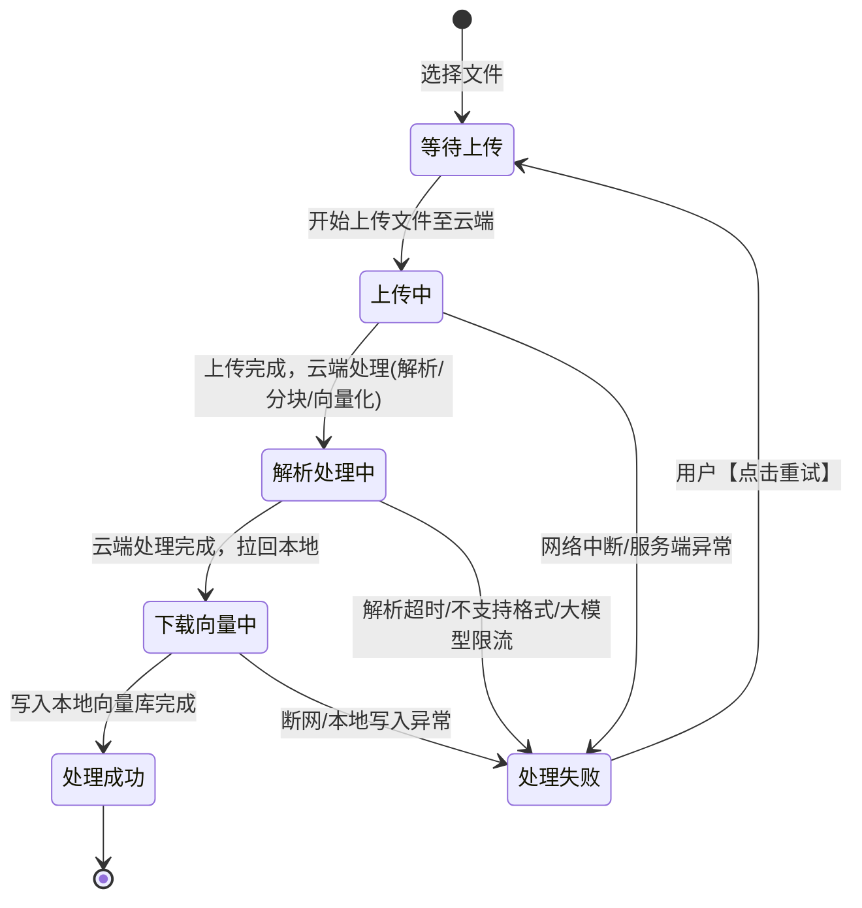

# 爱问学（端侧AI应用） - 知识库管理功能 PRD

## 1. 产品背景与业务目标
*   **业务背景：** “爱问学”作为一款面向 C 端的端侧 AI 应用，旨在为用户提供极简、顺滑的个人知识库问答体验。由于端侧算力有限，系统采用“云端处理，本地存储与检索”的混合架构。
*   **核心目标：**
    *   **极简体验：** 屏蔽分块（Chunking）、向量化参数等技术细节，实现“傻瓜式”建库与上传。
    *   **性能平衡：** 依托云端完成高耗能的文档解析与 Embedding 任务，释放终端设备压力。
    *   **高效问答：** 支持精确到段落的溯源（引用提示）及全局模糊检索。
*   **参与角色：** C端普通用户。

---

## 2. 核心大图与端云协同架构
*   **依赖关系：**
    *   **本地客户端：** 负责文件选择、本地物理存储（原始文件、向量库数据）、检索发起、问答结果与溯源呈现。
    *   **云端服务：** 负责文档解析（Parsing）、文本分块（Chunking，对用户透明）、向量化（Embedding）处理。
*   **非功能性需求：** 
    *   单文件限制 ≤ 20MB。
    *   支持格式：TXT, PDF, Word, Markdown。
    *   本地总知识库容量和文件数量暂无硬性限制（受限于用户本地设备磁盘）。

### 端云协同核心业务交互流程

---

## 3. 核心功能清单 (Feature List)

本模块针对系统核心能力进行结构化拆解，分为三大核心模块：知识库管理、文档管理、检索与问答溯源。

| 模块 | 需求点 | 子功能名称 | 功能描述 | 优先级 |
| :--- | :--- | :--- | :--- | :--- |
| **知识库管理** | 极简多库隔离 | 创建知识库 | 用户可自定义名称创建多个独立知识库，实现不同领域内容的物理/逻辑隔离。 | P0 |
| | | 切换/删除知识库 | 支持无缝切换当前工作台所属知识库，支持删除整个库及关联的本地索引等。 | P1 |
| **文档管理** | 多格式文件上传 | 本地文件导入 | 支持导入 TXT、PDF、Word、Markdown 格式文件，单文件大小上限 20MB。 | P0 |
| | 处理状态可视化 | 文档状态看板 | 实时展示文档上传与解析状态（等待中、处理中、成功、处理失败）。 | P0 |
| | 异常重试 | 失败重试机制 | 针对处理阶段（如网络中断、云端解析失败）的异常，提供“处理失败，请点击重试”操作。 | P1 |
| | 存储无上限 | 本地容量管理 | 系统本身不设总容量限制，唯一瓶颈为用户本地实体磁盘可用空间。 | P2 |
| **检索与问答溯源**| 大模型问答交互 | 知识库 QA 对话 | 在指定知识库内，用户通过自然语言输入问题，系统基于本地向量库检索并结合大模型生成回答。 | P0 |
| | 回答溯源展示 | 引用来源查看 | 大模型回答附带引用角标。点击角标后，在侧边栏/弹窗内展示溯源段落的**纯文本内容**。 | P0 |
| | 全局穿透 | 全局检索 (Global Search) | 支持通过关键字或语义在所有本地知识库中进行泛检索，定位相关文档。 | P1 |

---

## 4. 详细业务/功能规则设计

### 4.1 建库与极简上传交互
*   **交互原则**：To C 极简体验，隐藏复杂的“分块(Chunking)”和“向量化(Embedding)”等技术配置。
*   **建库流程**：用户点击「新建知识库」，输入库名称（限制 1-30 字符，不可重名）。创建成功后，页面主视图直接切换至该库的空白状态页，提供醒目的「拖拽上传」或「点击选择文件」区域。
*   **处算分离架构透明化**：用户上传文件后，系统在后台默默完成上云解析、分块、调用 Embedding 模型、拉取向量特征回本地、写入本地向量数据库的完整链路。前端仅需展示进度感知。

### 4.2 状态流转机制 (State Machine)
文档从选择到可被检索，需经历严密的状态机流转，确保数据一致性：

*   **交互话术**：失败状态统一展示为红色的 `处理失败，请点击重试` 按钮或 Tag。点击重试后，系统自动从阻断点或重新开始流转，不增加用户的操作负担。

### 4.3 问答与溯源链路
*   **提问范围**：问答对话默认在“当前激活的知识库”作用域内进行。
*   **答案流式输出**：接入 LLM 进行推断时，前端需支持 SSE (Server-Sent Events) 打字机效果，降低等待焦虑。
*   **溯源设计 (Citation)**：
    *   大模型在生成回答时，基于检索片段（Chunks）并在输出时附带 `[1]`、`[2]` 等角标标识。
    *   **展示方式**：用户点击数字角标，界面右侧滑出侧边栏（或屏幕中央弹出模态框）。
    *   **展示内容**：直接呈现匹配到的原始段落**纯文本**以及来源文件名称，**无需打开和渲染PDF/Word原文件**，降低阅读器开发复杂度并保证极速响应。

### 4.4 全局检索关联
*   **功能定位**：作为问答的补充辅助功能。当用户忘记某条信息在哪个知识库，或只需要单纯查询文件而无需大模型总结时使用。
*   **搜索逻辑**：在顶层搜索框输入 Query，系统在本地针对所有建立过索引的知识库并发执行跨库检索（BM25 或 语义检索）。
*   **结果呈现**：列表展示命中结果（归属知识库名、文档名、匹配段落摘要），点击可以查看溯源纯文本视图。

---

## 5. 关键边缘场景与非功能需求约束 (Acceptance Criteria & NFR)

### 5.1 本地强约束说明（无多端同步）
*   **约束前提**：本系统定位为“纯本地单机运行”的胖客户端环境。多端同步（如手机端和电脑端互通）目前**不予考虑**。
*   **数据驻留**：原文档、分块文本 (Chunks)、向量索引 (Vector Index) 以及用户的问答漫游记录，**全部强依赖并储存于用户本机的物理磁盘**。
*   **隔离与迁移**：用户更换设备时，除非存在整机或本地文件夹级别的物理备份迁移，否则新设备上的知识库为空。系统暂不支持通过云端账号拉取过往上传的私有文档。

### 5.2 网络兜底与服务端异常处理
系统属于“云+端”混合架构（云端算力+本地存储），高度依赖网络连通性。
*   **断网处理**：
    *   正在处理的文档会立即阻断并标记为 `处理失败，请点击重试`。
    *   在断网状态下发送问答请求，系统需在 3 秒内直接抛出防呆提示：“当前网络未连接，请检查网络后重新发送问题”。
    *   断网状态下，由于缺少云端大模型与Embedding服务，无法新建文档并进行问答。
*   **云端流控与重试**：如遇云服务瞬时高并发导致服务端报错，系统后台应具有指数退避的自动重试策略（不超过 3 次隐式重试）。若依然失败，再抛转至前端让用户手动重试。

### 5.3 性能与文件限制
*   **单点限制**：上传解析支持文件格式必须严格检验 `.txt, .pdf, .docx, .md`。单文件绝对大小限制 `≤ 20MB`，超限在前端选取文件阶段立刻拦截报错。
*   **容量限制**：受限于用户本地剩余磁盘空间。若探测到本地所在盘符磁盘空间不足（例如 < 500MB），需在上传前触发全局警告：“系统磁盘空间不足，知识库建库可能会失败，请及时清理。”